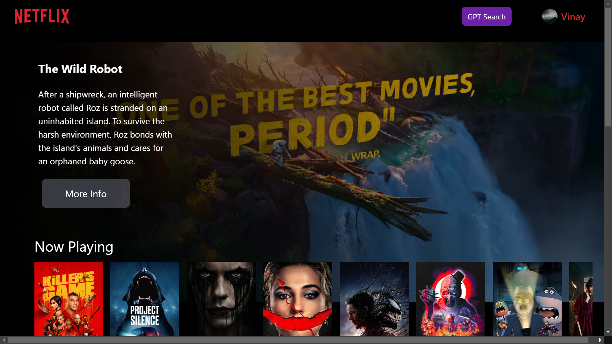
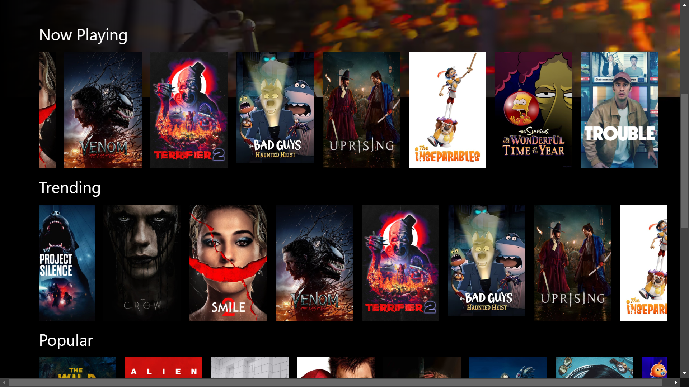
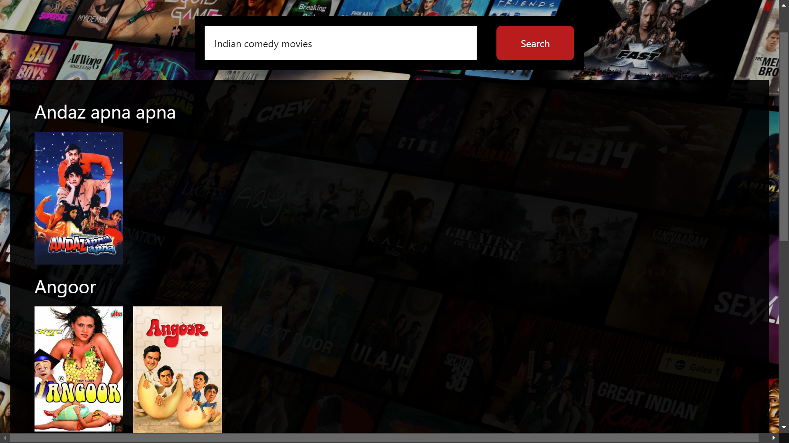

# Binging Bot

Binging Bot is a Netflix clone with an intelligent movie suggestion system. It provides personalized movie recommendations based on your input. Just type what kind of movie you're looking for (e.g., "Indian retro comedy movies"), and Binging Bot will show relevant movie suggestions such as _Andaz Apna Apna_ or _Hera Pheri_.

## Features

- **Movie Recommendations**: Using OpenAI API for prompt-based movie suggestions.
- **Movie Information**: Fetch movie data from TMDB (The Movie Database) API.
- **Google Authentication**: Firebase integration for Google OAuth authentication.
- **Guest Login**: Users can also log in as guests without needing to sign in with Google.
- **State Management**: Efficient state management using Redux.
- **Custom Hooks**: Custom hooks built for modular and reusable components.
- **Styling**: Modern, responsive design using Tailwind CSS.
- **Frontend Framework**: Built with React.js for a fast and dynamic UI.

## Project Demo

App is live at:  
**[binging-bot.vercel.app](https://binging-bot.vercel.app/)**





## How It Works

1. **Search Functionality**: Users can input keywords or phrases like "action movies", "Hindi comedy films", or "retro Bollywood hits", and the app will provide movie suggestions based on their input.
2. **Movie Data Fetching**: Using the TMDB API, Binging Bot fetches movie details, posters, and other relevant information to display to users.
3. **Authentication**: Users can sign in using their Google account via Firebase Authentication. For those who prefer not to sign in, there's an option for **Guest login**.
4. **State Management**: All application states, like movie search results and user information, are managed using Redux, ensuring a smooth and consistent user experience.

## Tech Stack

- **Frontend**: React.js
- **API Integration**:
  - OpenAI API for natural language processing and generating movie recommendations based on user input.
  - TMDB API for fetching movie data such as titles, posters, descriptions, etc.
- **Authentication**: Firebase Authentication (Google OAuth)
- **State Management**: Redux
- **Styling**: Tailwind CSS
- **Custom Hooks**: Used to create reusable, modular functionality.
- **Guest Login**: Seamless guest login for users who prefer not to log in.

## Setup Instructions

Follow these steps to set up and run Binging Bot locally:

1. **Clone the Repository**:

   ```bash
   git clone https://github.com/vinay6964/Binging-Bot.git
   cd Binging-Bot
   npm install
   REACT_APP_OPTIONS_KEY=<Your API Key>
   REACT_APP_OPENAI_API_KEY=<Your OpenAI API Key>
   REACT_APP_TMDB_API_KEY=<Your TMDB API Key>
   npm start
   ```

Access the repo at
http://localhost:3000
